<!-- Blueokanna | Clean Hacker Profile (GitHub-friendly) -->

  

  

  
  
  
  

---

  <svg width="900" height="160" viewBox="0 0 900 160" xmlns="http://www.w3.org/2000/svg" role="img" aria-label="About card">
    <defs>
      <linearGradient id="card" x1="0" y1="0" x2="1" y2="1">
        <stop offset="0" stop-color="#0d1117"/>
        <stop offset="1" stop-color="#0b1220"/>
      </linearGradient>
      <linearGradient id="line" x1="0" y1="0" x2="1" y2="0">
        <stop offset="0" stop-color="#22d3ee"/>
        <stop offset="1" stop-color="#0ea5e9"/>
      </linearGradient>
      <filter id="soft" x="-20%" y="-20%" width="140%" height="140%">
        <feGaussianBlur stdDeviation="6" result="b"/>
        <feMerge><feMergeNode in="b"/><feMergeNode in="SourceGraphic"/></feMerge>
      </filter>
    </defs>
    <rect x="10" y="10" width="880" height="140" rx="16" fill="url(#card)" stroke="#1f2937"/>
    <rect x="28" y="36" width="844" height="3" rx="2" fill="url(#line)" filter="url(#soft)"/>

    <text x="32" y="30" fill="#22d3ee" font-family="monospace" font-size="14">$ whoami</text>
    <text x="32" y="70" fill="#c9d1d9" font-family="monospace" font-size="14">backend engineer · open-source contributor · performance minded</text>
    <text x="32" y="96" fill="#c9d1d9" font-family="monospace" font-size="14">main: Rust / Java · tools: Linux / Git / Postman · db: SQLite</text>
    <text x="32" y="122" fill="#7c8a9d" font-family="monospace" font-size="14">learning: Rust deeper · Flutter UI</text>
    <text x="32" y="146" fill="#7c8a9d" font-family="monospace" font-size="14">contact: blueokanna@gmail.com</text>
  </svg>

---

### 📊 Activity & Stats (real)

  <!-- More stable than some third-party cards; still fully based on your repos -->
  

  

  

<!-- Optional: ultra-stable, self-hosted metrics (generated by GitHub Actions) -->

  

---

### 🛠️ Tech Stack

  

  Flipper Zero: icon not available on skillicons → listed here as hardware.

---

### 💛 Support

  

  

  

