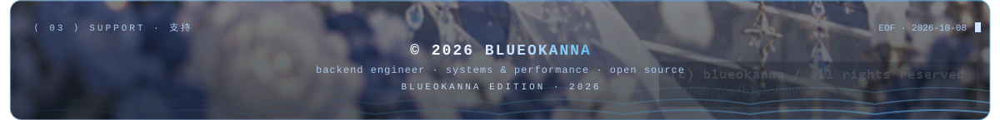

<!-- ══════════════════ blueokanna · github profile ══════════════════ -->

<div align="center">

<a href="https://github.com/blueokanna">
  
</a>


<br />

<a href="https://github.com/blueokanna"></a>


</div>


<h3 align="center">⟨ 01 ⟩ IDENTITY</h3>

<div align="center">
  
</div>

<p align="center">
  <a href="mailto:blueokanna@gmail.com"></a>
  <a href="https://github.com/blueokanna"></a>
</p>


<h3 align="center">⟨ 02 ⟩ BOOT SEQUENCE</h3>

<div align="center">
  
</div>

<details>
<summary align="center"><code>&nbsp;&nbsp;▸ manifest.toml&nbsp;&nbsp;</code></summary>

<br />

```toml
# who is behind the keyboard

[engineering]
focus   = ["backend services", "api-first design", "performance work"]
beliefs = ["measure before optimising", "small diffs", "ship, then harden"]

[toolbox]
languages  = ["Rust", "Java", "C", "C++", "Dart"]
frameworks = ["Flutter"]
systems    = ["Linux", "Windows", "Android", "Arduino"]
data       = ["SQLite", "IPFS"]
workflow   = ["Git", "GitHub Actions", "Postman", "Kali"]

[now]
learning = ["deeper Rust", "Flutter UI"]
open_to  = ["backend / systems collaborations", "open source"]
```

</details>


<h3 align="center">⟨ 03 ⟩ TELEMETRY</h3>

<p align="center">
  
</p>

<p align="center">
  
  
</p>


<h3 align="center">⟨ 04 ⟩ ARSENAL</h3>

<p align="center">
  
</p>

<p align="center">
  
</p>


<h3 align="center">⟨ 05 ⟩ SUPPORT</h3>

<p align="center">
  <a href="https://www.buymeacoffee.com/blueokanna">
    
  </a>
</p>

<p align="center">
  
</p>

<p align="center">
  
</p>
