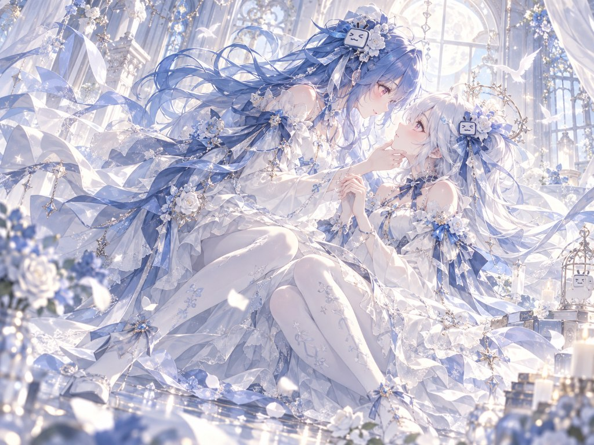

<!--
  ═══════════ blueokanna · hanayome edition / steam-styled profile ═══════════

  assets/banner.svg   hero art — artwork inlined from assets/hanayome-banner.jpg
  assets/profile.svg  steam-style profile card — avatar inlined from assets/hanayome-avatar.jpg

  The two SVGs inline their JPEGs as base64 on purpose: GitHub serves repo SVGs
  through the raw path (and camo), where relative <image href> lookups do not
  resolve. To change the art, re-crop assets/hanayome.jpg and re-inline the
  result into the <image> element of banner.svg / profile.svg.
-->

 
 

<h3 align="center">⟨ 01 ⟩ TELEMETRY · 数据</h3>

  

  

  
  

 

  

<h3 align="center">⟨ 02 ⟩ ARSENAL · 技术栈</h3>

  

<h3 align="center">⟨ 03 ⟩ ARTWORK · 原创画作</h3>

 
 

<code>hanayome edition · 2026</code> &nbsp;·&nbsp; original artwork by <a href="https://github.com/blueokanna">@blueokanna</a> &nbsp;·&nbsp; 点击查看原图

<h3 align="center">⟨ 04 ⟩ SUPPORT · 支持</h3>

  

  

  

